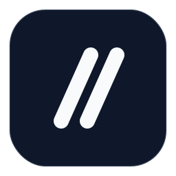

<p align="center">
  
</p>

<h1 align="center">BetterCode</h1>

<p align="center">
  <strong>Desktop workspace for AI-assisted coding.</strong>
</p>

<p align="center">
  
  
  
  
</p>

---

BetterCode is a native desktop app that brings Claude, Codex, Gemini, and local models into one workspace. You bring your own API keys or CLI runtimes; BetterCode handles routing, context, review, Git, and session history across all your projects.

---

## Table of Contents

- [Features](#features)
- [Installation](#installation)
- [Requirements](#requirements)
- [Supported Runtimes](#supported-runtimes)
- [Auto Model Select](#auto-model-select)
- [Configuration](#configuration)
- [Local Data](#local-data)
- [Architecture](#architecture)
- [Troubleshooting](#troubleshooting)
- [Contributing](#contributing)
- [License](#license)

---

## Features

**Auto Model Select** — Routes each request to the right model based on task type and complexity. Override it any time by picking a model directly.

**Multi-Project Workspaces** — Each project has its own chat history, files, and session state stored locally in SQLite. Multiple projects can run at the same time.

**Live Pipeline View** — Long tasks are broken into stages and run in parallel where possible. You can see each stage and its assigned model in real time.

**Code Review** — Pick files from your working tree, run a review pass, and get structured findings you can send back into chat to action.

**Git Integration** — Stage, unstage, commit, and push without leaving the app. Projects without a repository can be initialized directly from the Git tab.

**Generated Files** — AI outputs like PDFs, CSVs, and scripts are stored separately from your source in `~/.bettercode/generated-files/` and accessible per project in the sidebar.

---

## Installation

```bash
python -m venv .venv
source .venv/bin/activate    # Windows: .venv\Scripts\activate
pip install -e .
bettercode
```

> **Linux:** You may also need `sudo apt-get install libxcb-cursor0`

---

## Requirements

| Requirement | Notes |
|---|---|
| Python ≥ 3.10 | |
| PyQt6 ≥ 6.8 + PyQt6-WebEngine | |
| At least one coding CLI | `claude`, `codex`, or `gemini` |
| Ollama *(optional)* | For Auto Model Select |

---

## Supported Runtimes

| Runtime | Install |
|---|---|
| Claude CLI | `npm install -g @anthropic-ai/claude-code` |
| OpenAI Codex | `npm install -g @openai/codex` |
| Gemini CLI | `npm install -g @google/gemini-cli` |
| Local model | via [Ollama](https://ollama.com) |

API keys are stored in the system keychain and can be added in Settings.

---

## Auto Model Select

Auto Model Select uses a small local model to classify each request and pick the best available runtime for it. To use it, install [Ollama](https://ollama.com), then open **Settings → Local Preprocess** inside BetterCode to download a routing model. Once that's done it activates automatically.

You can swap the routing model or turn it off entirely from the same settings page. To skip routing for a single request, just select a model from the composer — that turn will go directly to the model you picked.

---

## Configuration

All environment variables are optional.

| Variable | Purpose |
|---|---|
| `BETTERCODE_HOME` | Override the default `~/.bettercode` data directory |
| `BETTERCODE_DEV` | Enable development mode (hot-reload static assets) |
| `OLLAMA_HOST` | Custom Ollama endpoint (default: `http://localhost:11434`) |
| `BETTERCODE_SELECTOR_MODEL` | Override the active routing model |
| `BETTERCODE_SELECTOR_KEEP_ALIVE` | How long to keep the routing model loaded |
| `BETTERCODE_MAX_COST_TIER` | Cap the cost tier Auto Model Select can choose |
| `BETTERCODE_PROXY_API_BASE` | Proxy base URL for API requests |
| `BETTERCODE_PROXY_TOKEN` | Auth token for the proxy |

---

## Local Data

```
~/.bettercode/
├── settings.json
├── state.db                 # workspaces, chat history, session state
└── generated-files/
    └── workspace-<id>/
```

API keys are stored in the system keychain via `keyring` and are never written to disk.

---

## Architecture

```
Desktop shell (PyQt6 + WebEngine)
        │
        ▼
FastAPI server (embedded, localhost-only)
        │
        ├── SQLite ─────── workspace and chat history
        ├── Selector ────── local routing model via Ollama
        │       └── routes to ──┐
        ├── Claude CLI  ◄───────┤
        ├── Codex CLI   ◄───────┤
        └── Gemini CLI  ◄───────┘
```

The desktop shell is a thin PyQt6 window embedding a `QWebEngineView` pointed at the local FastAPI server. All application logic lives in the FastAPI layer. The Qt layer handles native OS integration: tray icon, file dialogs, and system keychain access.

---

## Troubleshooting

**Auto Model Select isn't working**
Open Settings → Local Preprocess and confirm a routing model shows as Installed, and that Ollama is running (`ollama serve`).

**The app won't launch**
Confirm `PyQt6` and `PyQt6-WebEngine` are installed. On Linux, make sure `libxcb-cursor0` is installed.

**A runtime shows as unavailable**
Check that the CLI is on your `PATH` — `claude --version` (or `codex`, `gemini`) should work in your terminal. For API-key runtimes, check Settings → API Keys.

---

## Contributing

| File | Purpose |
|---|---|
| `bettercode/web/api.py` | FastAPI routes and chat streaming |
| `bettercode/web/static/app.js` | Frontend (vanilla JS) |
| `bettercode/router/selector.py` | Auto Model Select routing |
| `bettercode/web/desktop.py` | PyQt6 desktop shell |
| `bettercode/web/git_ops.py` | Git operations |

---

## License

AGPL-3.0-or-later
